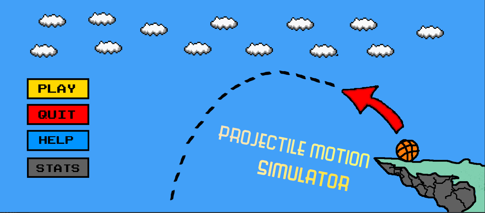
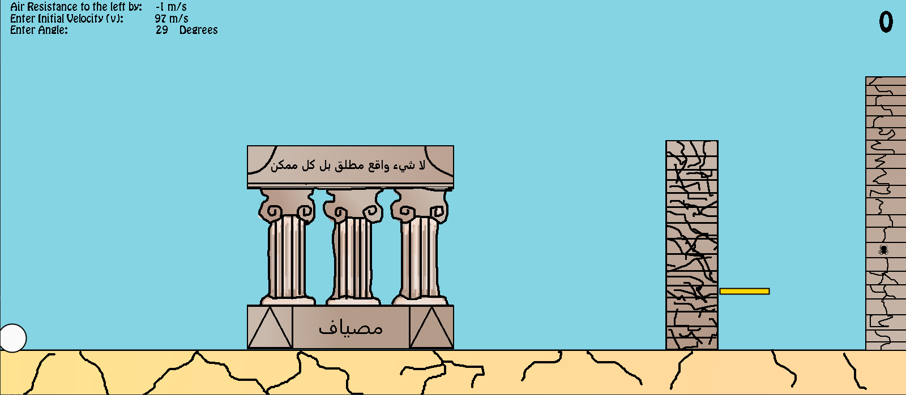
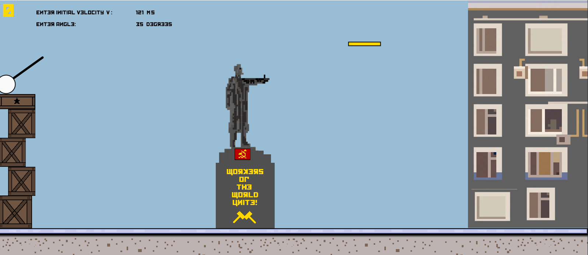

# Project Installation 
To install the game, make sure you have Processing downloaded on your computer. Simply download all project files and run the .pde file in the Processing IDE. 

# Snapshots 

 
 

# Documentation 
Documenation in google document: [HERE](https://docs.google.com/document/d/1qmW7YT-PaAwvy0ToLdwqr7YJ7Sde7eVS64WWtuWrQlc/edit) 
